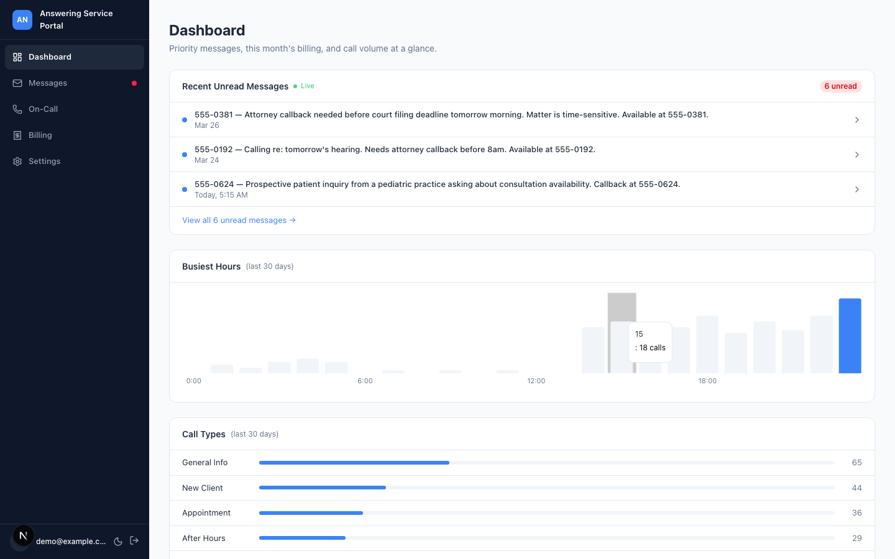
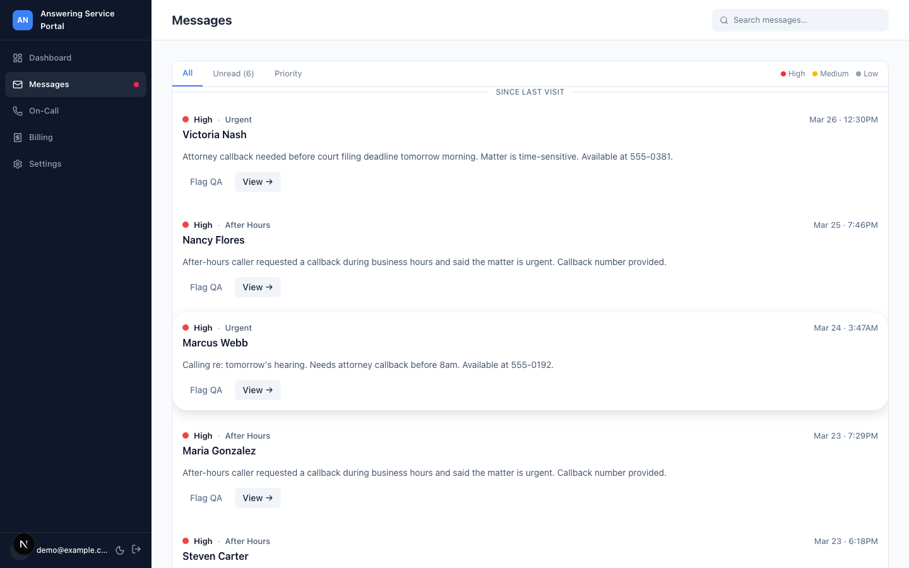
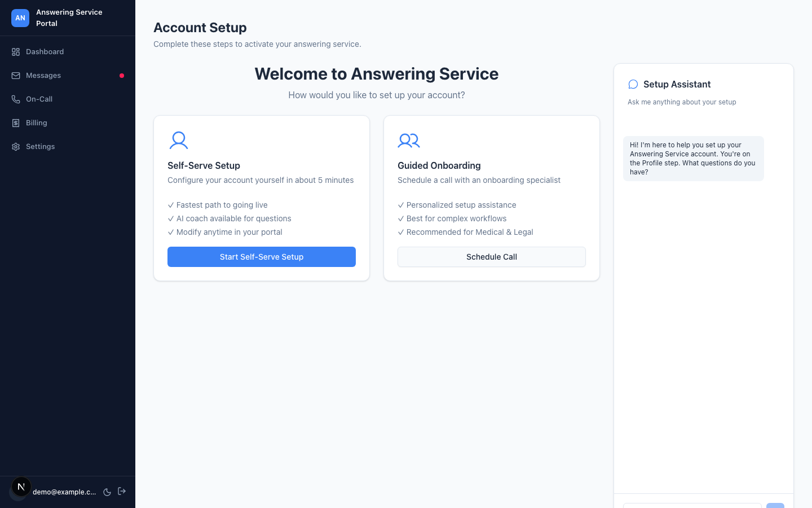
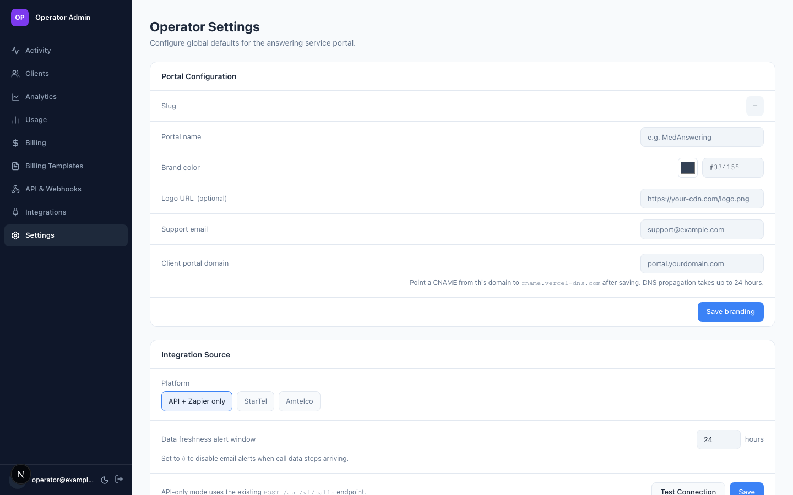

# Stintwell Portal — Community Edition

A white-label customer portal and operator admin for telephone answering services.

Operators deploy it for their clients (law firms, medical offices, property managers) who use it to view their calls, on-call schedules, and billing estimates in real time.

---

## Screenshots

| Client Dashboard | Messages Inbox |
|-----------------|----------------|
|  |  |

| Setup Wizard | Operator Admin |
|---|---|
|  |  |

---

## What's Included

- **Client portal** — message inbox with search and tab filtering, message detail with transcript and audio, dashboard with call volume charts, on-call schedule view, billing estimate view, setup wizard
- **Real-time updates** — live unread count and toast notifications via Supabase Realtime
- **PWA install prompt** — mobile-installable portal
- **White-label branding** — per-operator color, logo, and custom domain support
- **Core operator admin** — client list with health scores, client detail, add client flow, user invite
- **API key management** — create and revoke bearer token keys per client or operator
- **Webhook subscriptions** — HMAC-signed delivery, delivery log, manual retry
- **Integration config** — adapter type selection, connection test
- **REST API** (`/api/v1/*`) — full call ingest and query surface; OpenAPI spec included
- **Billing engine** — per-call, per-minute, flat monthly, and bucket rules; running estimate in client portal
- **Billing rule templates** — create and apply reusable billing configurations across clients
- **On-call scheduling** — recurring shifts, escalation steps, timezone-aware resolution
- **Setup wizard** — multi-step onboarding flow with vertical presets
- **AI chat assistants** — wizard coach and dashboard helper, configurable via env vars and prompt files
- **Operator provisioning CLI** — `npm run provision` to create an operator org
- **Starter seed** — `npm run seed:starter` for sample data

---

## What's in the Managed Platform

The following features are available in the Stintwell managed deployment and are not included in this repository:

- **Analytics and reporting** — call volume trends, busiest hours, engagement heatmaps, churn risk scores, client-level analytics
- **Scheduled reports** — weekly email digest, monthly billing summary
- **Operator billing dashboard** — cross-client MRR, revenue trends
- **Billing CSV export** — bulk and per-client export, QuickBooks-compatible
- **PDF invoice generation** — branded, downloadable invoices
- **HIPAA compliance mode** — PHI access logging, audit trail enforcement, BAA
- **Native StarTel and Amtelco adapters** — polling-based call ingest without Zapier
- **Integration health dashboard** — data freshness monitoring, error history, alert configuration
- **Bulk client import** — CSV-based migration for operators moving from another system
- **Email alerts** — billing threshold notifications, data freshness alerts

Contact [hello@stintwell.com](mailto:hello@stintwell.com) for managed deployment.

---

## Quick Start

### Deploy to Vercel

[](https://vercel.com/new/clone?repository-url=https://github.com/stevembarclay/answering-service-portal)

Set the required environment variables in Vercel (see `.env.example`), run migrations against your Supabase project, then provision your first operator.

### Run Locally

```bash
npm install
cp .env.example .env.local
# Fill in NEXT_PUBLIC_SUPABASE_URL, NEXT_PUBLIC_SUPABASE_ANON_KEY, SUPABASE_SERVICE_ROLE_KEY
# Apply migrations to your Supabase project (see Self-Hosting Guide below)
npm run seed:starter    # optional: load sample data
npm run dev
```

---

## Architecture

Built on **Next.js 15 App Router**, **React 19**, **Tailwind CSS**, **shadcn/ui**, and **Supabase** (Postgres + RLS + Realtime + Storage). Deployed on Vercel.

Two-sided platform:
- `app/(platform)/answering-service/*` — client portal (what operators' clients see)
- `app/(operator)/operator/*` — operator admin (what the answering service company sees)
- `app/api/v1/*` — public REST API for call ingest and query
- `lib/services/` — all business logic; no Supabase calls in components or pages

Multi-tenant by design. Client data is scoped by `business_id`. Operator data is scoped by `operator_org_id`. Both are derived from the authenticated session — never from request parameters.

Full architecture reference: [docs/developer/ARCHITECTURE.md](docs/developer/ARCHITECTURE.md)

---

## Integration

### REST API

The `/api/v1/*` routes accept bearer token authentication and cover call ingest, on-call query, and recording retrieval.

Reference: [docs/api/reference.md](docs/api/reference.md)

### Webhooks

Subscribe to call events with HMAC-signed delivery. The operator admin includes a delivery log and manual retry UI.

Reference: [docs/api/webhooks.md](docs/api/webhooks.md)

### Build Your Own Adapter

Implement `ICallSourceAdapter` to connect any telephony system. The interface defines `fetchNewCalls(since: Date)` and a `name` discriminator. `ApiPushAdapter` is the reference implementation — it treats inbound POST requests to `/api/v1/calls` as the call source.

Guide: [docs/integrations/adapter-guide.md](docs/integrations/adapter-guide.md)

### Telephony system webhook

Most telephony platforms support outbound HTTP webhooks. Configure yours to POST call events to `POST /api/v1/calls` with a bearer token. The portal accepts a JSON array or CSV upload.

If your platform doesn't support outbound HTTP natively, you can use an automation bridge (Zapier, Make, n8n) to forward events to the endpoint.

Reference: [docs/api/reference.md](docs/api/reference.md)

---

## Self-Hosting Guide

### Requirements

- Node.js 20+
- A Supabase project (free tier works for evaluation)
- A Vercel account (or any platform that runs Next.js)

### Supabase Setup

1. Create a new Supabase project
2. In the SQL editor, run each migration in `migrations/` in filename order
3. Copy your project URL and API keys into `.env.local`

### Environment Variables

Copy `.env.example` to `.env.local` and fill in the values. Required:

| Variable | Description |
|---|---|
| `NEXT_PUBLIC_SUPABASE_URL` | Supabase project URL |
| `NEXT_PUBLIC_SUPABASE_ANON_KEY` | Supabase anon key |
| `SUPABASE_SERVICE_ROLE_KEY` | Supabase service role key |
| `NEXT_PUBLIC_APP_URL` | Your deployment URL |

All other variables are optional. See `.env.example` for details.

### Run Migrations

Apply every file in `migrations/` to your Supabase project in filename order via the SQL editor or the Supabase CLI:

```bash
supabase db push
```

### Create Your First Operator

```bash
npm run provision
```

The CLI will prompt for an org name and admin email, then create the operator org and send an invite.

---

## Contributing

This repository is the public community edition. The private upstream repo is the source of truth; this repo is generated by a strip script on each release.

To contribute:
- Open an issue to discuss the change before sending a PR
- PRs must pass `npx tsc --noEmit` and `npm test`
- Follow the architecture constraints in [docs/developer/ARCHITECTURE.md](docs/developer/ARCHITECTURE.md)
- No Supabase calls in components or pages — all DB access goes through `lib/services/`

---

## License

AGPL-3.0. See [LICENSE](LICENSE).

If you need to embed this in a commercial product without AGPL obligations, contact [hello@stintwell.com](mailto:hello@stintwell.com) for a commercial license.
